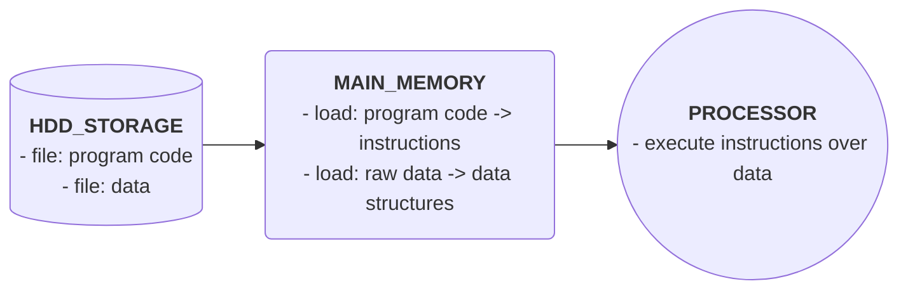

# Data

Programming is instructions to act upon data. Without data, the instructions act upon nothing.

Here we will see a brief introduction so to distinguish between:

- data structures
- databases
- data warehouses
- big data

## Data Structures

Arrangement of a collection of data items so that they can be utilized efficiently. Not any arrangement, but the arrangement of it in the main memory on execution time (temporary storage), for optimum utilization of it (the more efficient use at execution time).

## Database

Arrangement of data in some model (relational, document, nodes ...) in the main storage (the hdd storage, the permanent storage) where it can be optimally retrieved when needed.

Operational data is maintained here and, as it is being consolidated, it will compose the historical data.

## Data Warehouse

Mainly used to keep historical data generated by the operations. Very large array of disks containing permanent data, used mainly for analytical purpose, that is, not all of it must be active at all time.

## Big Data

Studying and utilizing very large data collections, not necessarily produced by one organization, but widely available, as on the internet.