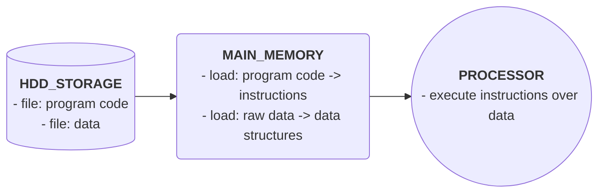
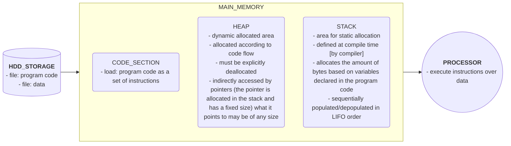

## Data

Programming is instructions to act upon data. Without data, the instructions act upon nothing.

Here we will see a brief introduction so to distinguish between:

- data structures
- databases
- data warehouses
- big data

### Data Structures

Arrangement of a collection of data items so that they can be utilized efficiently. Not any arrangement, but the arrangement of it in the main memory on execution time (temporary storage), for optimum utilization of it (the more efficient use at execution time).

### Database

Arrangement of data in some model (relational, document, nodes ...) in the main storage (the hdd storage, the permanent storage) where it can be optimally retrieved when needed.

Operational data is maintained here and, as it is being consolidated, it will compose the historical data.

### Data Warehouse

Mainly used to keep historical data generated by the operations. Very large array of disks containing permanent data, used mainly for analytical purpose, that is, not all of it must be active at all time.

### Big Data

Studying and utilizing very large data collections, not necessarily produced by one organization, but widely available, as on the internet.

## Static vs Dynamic Memory Allocation

- about main memory
- how a program uses memory
- static allocation
- dynamic allocation

### Main Memory

Main memory (or the RAM) is divided in small addressable units, usually bytes. Each byte is an 8 bits unit with an individual, linear and sequential address.

|       |       | **memory** |       |       |
|:-----:|:-----:|:----------:|:-----:|:-----:|
|  0    |  1    |     2      |  3    |  4    |
|       |       |     ...    |       |       |
|       |       |     ...    |       |       |
|       |       |     ...    |       |       |
| 65531 | 65532 |    65533   | 65534 | 65535 |

- **memory addresses**: 0-65535
- **memory size**: 65536 bytes **or** [(65536/1024) =] 64KB[^1]
  - Both *65536 bytes* and *64 kilobytes* refer to a quantity of 65536 addresses of *8 bits* each, in this context

A large memory, such as 256MB is usually divided into **segments** for better administration. This segments are usually parts of a "natural" size for the context, for instance, in the 8x86 architecture 64KB(KiB). By doing so, instead of addressing 65536 units, we have access to 65536 segments, each comprised by 65536 addressable bytes. This technic is called *segmentation* and can be further explored with *pagination* allowing to expand the amount of addressable memory.

[^1]:
 on computing the base system is implemented upon the binary system, all numbers been powers of two.
 When we say *kilo* on this context, we are not referring to 10^3, as in the usual decimal context, but actually to 2^10. So we are not dividing by 1000 (10x10x10), but by 1024 (2x2x2x2x2x2x2x2x2x2).
 In 1998 the International Electrotechnical Commission (IEC) proposed the use of a different term, the *kibibyte* (KiB) for denoting 1024 bytes and avoiding ambiguity with the decimal reference, but that term is not widely used.

### Program Memory Usage

