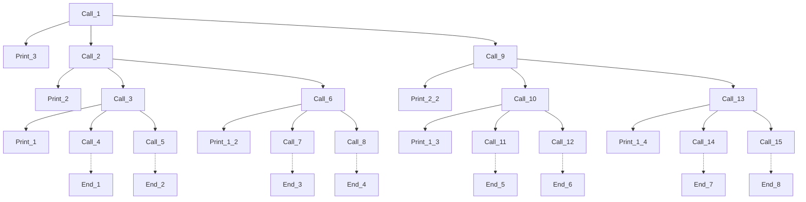

# types of recursion

- linear recursion
  - tail recursion
  - head recursion
- tree recursion
- indirect recursion
- nested recursion

## Tail recursion

When the recursive call is the last call in the function. Every thing is performed at calling time, nothing at returning time. It has the following format:

```c
Type myRecFun(param)
{
    if(condition) // method for terminating the recursion
    {
        ... // calling time execution
        myRecFun(param); // returning time - no more executions from this scope
    }
}
```

- This type of recursion can easily be converted into a **loop**
- considering the *time complexity* a loop and this function are equivalent
- considering the *space complexity* the loop is more efficient, since it will not create a new stack activation record for each successive execution (this is not true for all languages, some languages actually benefits from tail recursion by compiler technics, Python would be susceptible to stack overflow, whereas Haskell would take advantage of a tail recursion by a technique called Tail Call Optimization)

## Head recursion

When the recursive call is the first call in the function. Nothing is performed at calling time, everything at returning time. It has the following format:

```c
Type myRecFun(param)
{
    if(condition) // method for terminating the recursion
    {
        myRecFun(param); // calling time execution
        ... // returning time - no more executions from this scope
    }
}
```

## Tree recursion

Both previous cases are examples of **linear recursion**, each function calls itself only once.

Tree recursion is a complex scenario where we have recursions calling their selfs more than once, in whatever order. The following is an acceptable format for it:

```c
Type myRecFun(param)
{
    if(condition) // method for terminating the recursion
    {
        ... // calling time execution
        myRecFun(param);
        ...
        myRecFun(param); 
        ... // returning time - no more executions from this scope
    }
}
```

To understand it's name and why it is a complex function, let's analyze a case:

```c
void myFun(int n)
{
    if(n>0)
    {
        printf("%d", n);
        myFun(n-1);
        myFun(n-1);
    }
}

void main()
{
    myFun(3);
}
```



In the above structure, we can see that for a value of 3, we'll have a tree structure with 4 levels, that is to say our stack will have a pile of four initialized frames at one time, in the max, and, concerning number of executions, we'll have 15 calls to the recursive function.

For each level the double of calls are made in relation to the previous level, so, this function has a degree of time complexity of O(2^n) - for each increase to the value we have the double +1 of function calls. (it is a sum of therms of a geometric progression - 1 + 2 + 4 + 8 = 15).

For the space complexity we have to use 4 activation records in the stack for a value of 3, so it was n+1. This is a spca complexity of the order of n, O(n).

## Indirect recursion

Is sort of a cyclic recursion, where a function end up calling itself trough another called function.

```c
Type myRecFunA(param)
{
    if(condition) // method for terminating the recursion
    {
        ... // calling time execution
        myRecFunB(param);
        ... // returning time - no more executions from this scope
    }
}

Type myRecFunB(param)
{
    if(condition) // method for terminating the recursion
    {
        ... // calling time execution
        myRecFunA(param);
        ... // returning time - no more executions from this scope
    }
}
```

## Nested recursion

Is a recursion where the parameter of the recursive call is a recursive call itself.

```c
Type myRecFun(param)
{
    if(condition) // method for terminating the recursion
    {
        ... // calling time execution
        myRecFun(myFun(param));
        ... // returning time - no more executions from this scope
    }
}
```