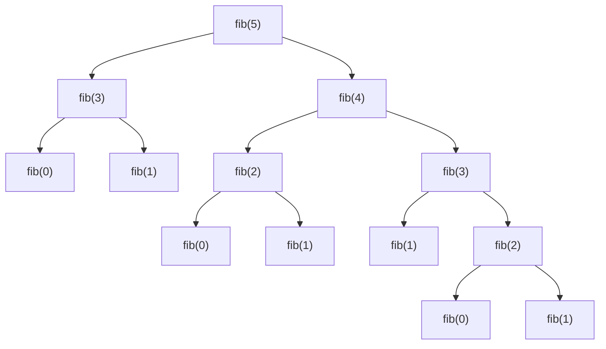

# Fibonacci Series

This series usually starts with 0 and 1 and, after that, each subsequent number is the sum of its two predecessors. Mathematically, the function to find a particular number by its position in the series would be $f(n) = f(n-1) + f(n-2)$. As the sequence progress, the ratio between two subsequent numbers gets closer to the value of the *golden ratio* ($\phi$) - an irrational number 1.618033988749... .

$$0,1,1,2,3,5,8,13,21,34,55,89,114,233,377,610,987,1597,2584,4181...$$

The basic implementation of a recursive version for the Fibonacci series is an example of a **excessive recursion**, a recursion that calls itself multiple times for the same parameter value (the same calculation is done multiple times).

This, in terms of time complexity, is in the order of $2^n$ - $O(2^n)$. We could reduce it by using global/static variables, to store the calculation values and avoid subsequent calls to the same calculation. By doing so, we will reduce it to the order of n - $O(n)$. This technique is called **memoization**.
