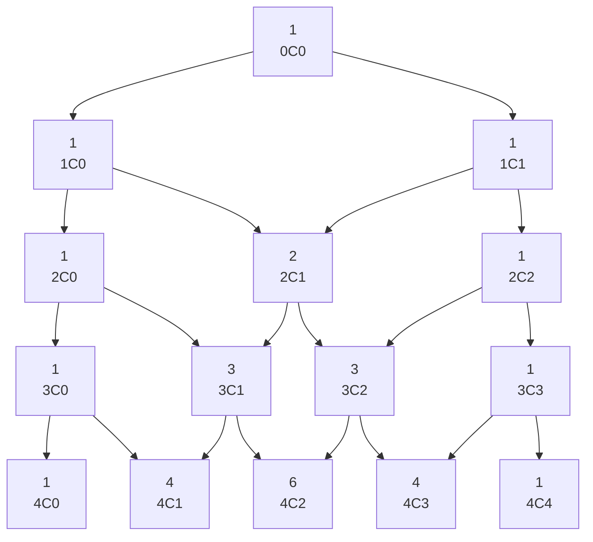

# Combination

In math, combination refers to the selection of items from a set of distinct members with no concern for the order - for instance, in a set of 3 objects we have only one way to take 3 elements, whereas in a set of 4 elements we hve 4 ways of taking 3 elements (in each of these one of the 4 will be out).

The math formula for obtaining the number of possible combinations is 
$$^nC_r = {n! \over r!\times(n-r)!}$$

Where **C** is the number of combinations, **n** the number of elements in the main set and **r** the number of elements in the subset.

## Pascal's triangle

The Pascal's triangle presents the problem of how to find the possible number of combinations in a recursive way (the *0C0* stands for *nCr*):

Looking to it, we may see that, for a set of 4 elements, if we want to take subsets of 2 elements, we may construct 6 distinct combinations.

Also, we may see that each total number of combinations can be obtained by summing the upper two ones:
$$^nC_r = ^{n-1}C_{r-1} + ^{n-1}C_r$$
