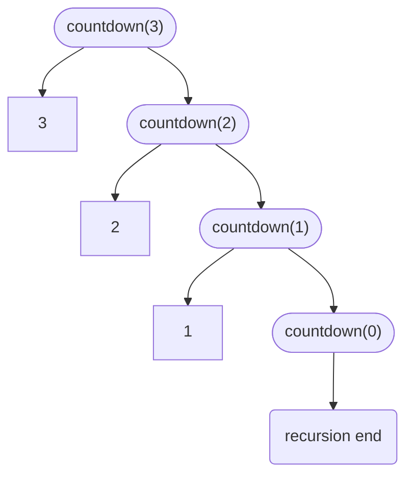
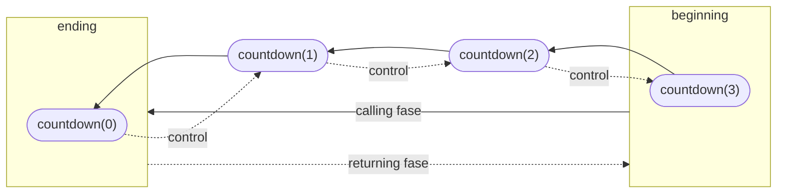

# Recursion overview

- what it is
- example of recursion
- tracing recursion
- stack used in recursion
- time complexity
- recurrence relation

## What is recursion

A function which calls itself, generally in the following pattern:

```c
Type myRecFun(param)
{
    if(condition) // method for terminating the recursion
    {
        ... // calling time execution
        myRecFun(param);
        ... // returning time execution
    }
}
```

## Tracing a recursive function

Recursive functions are traced using a tree, the `tracing tree of a recursive function`:

```c
void countdown(int n)
{
    if (n > 0)
    {
        printf("%d", n);
        countdown(n - 1);
    }
}
```

If we call the previous function passing a value of 3, we will have the following call structure:



When the recursion reaches the end condition, any additional statements on the function are executed and  the execution goes back to the previous caller function, this happens successively, from one celled function to it's caller:



- The `calling fase` is also called as `ascending fase`
- The `returning fase` is also called `descending fase`

### Recursion vs Loop

Recursion is a form off loop. The difference is that loop only provides the ascending fase, while a recursion provides the ascending and descending fase.

This fase differentiation allows, for instance that the same countdown function, be turned in a count function, by switching `printf("%d", n)` statement from the line above the recursive call to the line bellow it.

## time complexity

Recursive functions are _memory consuming functions_: for each each execution a new activation record is created at the stack and this activation record will take as much memory as the required by the function being called.

In the case of our example `countdown` function, for a value of *n* in the argument, we will need *n+1* multiplied by the amount of memory required by the function - in this case the size required by an integer, for instance 2 bytes.

This give us a function with a **order of n** or **O(n)**.

## Global and static variables in recursions

Variables declared within the recursion scope are newly initialized in each function call and their load is added up in the stack memory. By using a static or a global variable we reduce the memory load that a recursive function will take.

Global variables provides us with a state variable, we can preserve a value and access it through all different function calls scopes. It also may simplify the amount of arguments a function needs, simplifying it's readability.

In the other hand, we are adding complexity to the code, since we cannot take a function as a pure function, but it becomes a stateful function, meaning it may render different results, depending on the variable current value. The reusability of the function decreases and it becomes harder for debugging, since we cannot infer that a specific result is product of a specific function call or code flow - if more parts of the code may change a global variable, we must test the combination of flows, not only the individual functions running independently.
